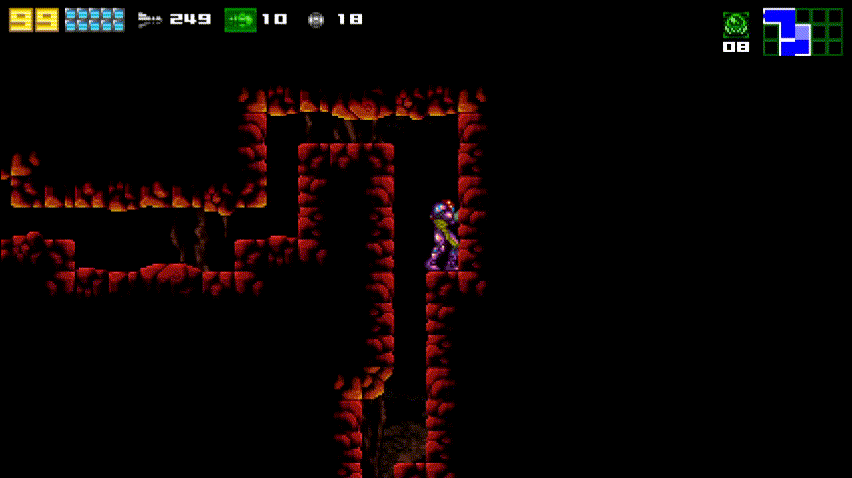

# Some Known Logical Gotchas

## Industrial Complex Entry with Speed Booster and Power Bombs
Its kinda tight but you are able to charge a spark from the ledge.  Crouching does in fact make it charge slightly faster

## Distribution Center without Ice Beam or Screw Attack
While you can get to Distribution Center without Ice Beam or Screw Attack, it is not logical to do so as you will be unable to leave 
softlocked without either of those items.

With that said, with the return to ship from last save being introduced in 1.3.0, it is much more feasible to do this but it still remains illogical.  
You are never expected to softlock yourself in this randomizer. 

## Distribution Center Main entrance without Power Bombs
With the above in mind it is possible that you need to enter Distribution Center without Power Bombs from the main caves entrance.

## Underwater Distribution Center without Gravity Suit and Speed Booster
There is a low% shortcut in the underwater section of the Distribution Center that allows you to skip needing gravity suit and speed booster.

